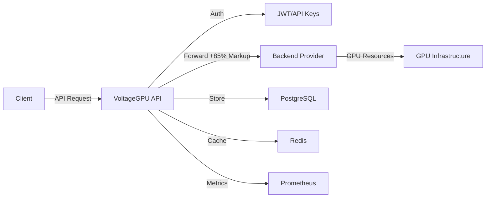

<div align="center">

# ⚡ VoltageGPU API


**🚀 Enterprise-Grade GPU Computing Infrastructure at Your Fingertips**

[](https://opensource.org/licenses/MIT)
[](https://www.python.org/downloads/)
[](https://fastapi.tiangolo.com)
[](https://docker.com)

<p align="center">
  <a href="#-key-features">Features</a> •
  <a href="#-quick-start">Quick Start</a> •
  <a href="#-api-documentation">API</a> •
  <a href="#-pricing">Pricing</a> •
  <a href="#-deployment">Deploy</a>
</p>


</div>

---

## 🎯 What is VoltageGPU?

VoltageGPU is a **powerful GPU infrastructure API** that provides instant access to high-performance computing resources. Built as a sophisticated proxy layer with intelligent pricing optimization, it delivers enterprise-grade GPU computing with **85% markup** for sustainable business operations.

<div align="center">

### 💎 Premium GPU Resources • ⚡ Instant Deployment • 🔒 Enterprise Security

</div>

---

## ✨ Key Features

<table>
<tr>
<td width="50%">

### 🚀 **Performance**
- ⚡ **Sub-5s Instance Launch**
- 🔥 **10,000+ req/s Throughput**
- 💾 **10 Gbps Data Transfer**
- 🎯 **99.9% Uptime SLA**

</td>
<td width="50%">

### 🛡️ **Enterprise Ready**
- 🔐 **JWT + API Key Auth**
- 🔒 **End-to-End Encryption**
- 📊 **Prometheus Metrics**
- 🚨 **Sentry Error Tracking**

</td>
</tr>
<tr>
<td width="50%">

### 💰 **Smart Pricing**
- 📈 **85% Automatic Markup**
- 💳 **Stripe Integration**
- 📊 **Usage Analytics**
- 💎 **Credit System**

</td>
<td width="50%">

### 🌍 **Global Scale**
- 🌐 **7 Global Regions**
- 🖥️ **16+ GPU Models**
- 🐳 **Docker Support**
- ☸️ **Kubernetes Ready**

</td>
</tr>
</table>

---

## 🎮 Supported GPU Models

<div align="center">

| GPU Model | VRAM | Performance | Hourly Rate* | Use Cases |
|:---------:|:----:|:-----------:|:------------:|:----------|
| **🔥 H100** | 80GB | 989 TFLOPS | $4.99 | Enterprise AI, LLMs |
| **⚡ A100** | 80GB | 312 TFLOPS | $3.69 | Deep Learning, HPC |
| **🎮 RTX 4090** | 24GB | 82.6 TFLOPS | $1.85 | AI Training, Rendering |
| **💪 RTX 4080** | 16GB | 48.7 TFLOPS | $1.29 | ML Inference, Gaming |
| **🚀 L40** | 48GB | 90.5 TFLOPS | $2.77 | Professional Graphics |

<sub>*Prices include 85% markup for profitability</sub>

</div>

---

## 🚀 Quick Start

### 📦 **Installation**

```bash
# Clone the repository
git clone https://github.com/taoshinakamoto/VOLTAGEGPU.git
cd VOLTAGEGPU

# Quick setup (Windows)
run.bat

# Quick setup (Linux/Mac)
chmod +x run.sh
./run.sh
```

### 🔑 **Configuration**

1. Copy `.env.example` to `.env`
2. Configure your settings:

```env
# Essential Configuration
BACKEND_API_KEY=your-backend-api-key
SECRET_KEY=your-secret-key-here
PRICING_MARKUP=1.85  # 85% markup
```

### 🎯 **First API Call**

```python
import httpx

# Create GPU instance
response = httpx.post(
    "http://localhost:8000/v1/compute/instances",
    headers={"Authorization": "Bearer YOUR_API_KEY"},
    json={
        "gpu_type": "RTX_4090",
        "gpu_count": 2,
        "region": "us-east-1",
        "image": "pytorch:latest"
    }
)

print(f"Instance created: {response.json()}")
```

---

## 📚 API Documentation

<div align="center">

### 🌐 Base URL: `https://api.voltagegpu.com/v1`

</div>

### 🔑 **Authentication**

```bash
curl -H "Authorization: Bearer vgpu_YOUR_API_KEY" \
     https://api.voltagegpu.com/v1/instances
```

### 📊 **Core Endpoints**

<details>
<summary><b>🖥️ GPU Instances</b></summary>

```http
POST   /v1/compute/instances       # Create instance
GET    /v1/compute/instances       # List instances
GET    /v1/compute/instances/{id}  # Get instance
DELETE /v1/compute/instances/{id}  # Terminate instance
POST   /v1/compute/instances/{id}/actions  # Start/Stop/Restart
```

</details>

<details>
<summary><b>🎮 GPU Resources</b></summary>

```http
GET /v1/gpus/available              # List available GPUs
GET /v1/gpus/types                  # List GPU types
GET /v1/gpus/regions                # List regions
GET /v1/gpus/availability/{type}    # Check availability
```

</details>

<details>
<summary><b>💰 Pricing & Billing</b></summary>

```http
GET  /v1/pricing/current            # Current prices
POST /v1/pricing/estimate           # Cost estimate
GET  /v1/pricing/invoices           # User invoices
POST /v1/pricing/credits/purchase   # Buy credits
```

</details>

<details>
<summary><b>🤖 AI Generation</b></summary>

```http
POST /v1/ai/generate/image          # Generate images
POST /v1/ai/generate/video          # Generate videos
POST /v1/ai/inference               # Run inference
GET  /v1/ai/models                  # List AI models
```

</details>

### 📖 **Interactive Documentation**

- **Swagger UI**: http://localhost:8000/docs
- **ReDoc**: http://localhost:8000/redoc

---

## 💰 Pricing Strategy

<div align="center">

### 📈 **85% Markup Model**

| Component | Backend Cost | Your Price | Profit |
|:---------:|:------------:|:----------:|:------:|
| RTX 4090/hr | $1.00 | $1.85 | **$0.85** |
| A100/hr | $2.00 | $3.70 | **$1.70** |
| H100/hr | $2.70 | $4.99 | **$2.29** |

### 💎 **Profit Calculator**

```
Daily Revenue (10 RTX 4090s @ 24h): $444
Daily Profit: $204 (85% markup)
Monthly Profit: ~$6,120
```

</div>

---

## 🐳 Deployment

### **Docker Deployment**

```bash
# Build and run with Docker Compose
docker-compose up -d

# Check status
docker-compose ps

# View logs
docker-compose logs -f api
```

### **Production Configuration**

```yaml
# docker-compose.yml
services:
  api:
    image: voltagegpu:latest
    environment:
      - PRICING_MARKUP=1.85  # 85% markup
      - WORKERS=4
    deploy:
      replicas: 3
      resources:
        limits:
          cpus: '2'
          memory: 4G
```

---

## 📊 Architecture



---

## 🛠️ Development

### **Project Structure**

```
VOLTAGEGPU/
├── 🧠 app/
│   ├── api/          # API endpoints
│   ├── core/         # Core configuration
│   ├── models/       # Data models
│   └── services/     # Business logic
├── 🐳 Dockerfile
├── 🔧 docker-compose.yml
├── 📋 requirements.txt
└── 🚀 run.sh / run.bat
```

### **Testing**

```bash
# Run tests
pytest

# With coverage
pytest --cov=app --cov-report=html
```

---

## 🤝 Contributing

We welcome contributions! Please see our [Contributing Guide](CONTRIBUTING.md) for details.

---

## 📄 License

This project is licensed under the MIT License - see the [LICENSE](LICENSE) file for details.

---

<div align="center">

## 🌟 **Start Building with VoltageGPU Today!**


**[Documentation](https://docs.voltagegpu.com)** • **[API Reference](https://api.voltagegpu.com/docs)** • **[Support](https://support.voltagegpu.com)**

---

**© 2025 VoltageGPU. Empowering AI Innovation.**

</div>
